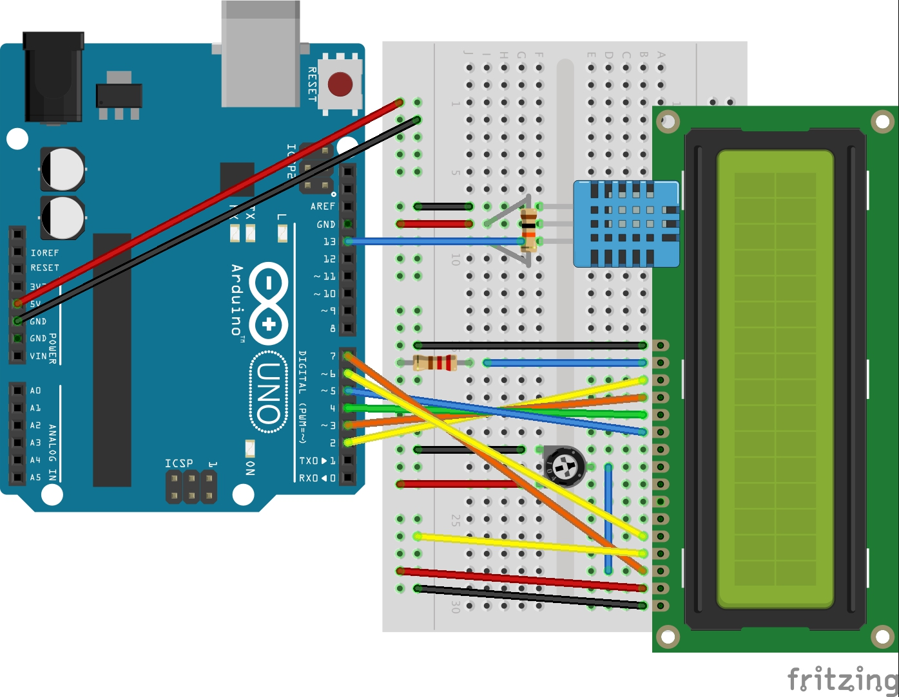

# DHT11-LCD
An Arduino project to display DHT11 temperature and humidity readings to an LCD screen. This layout uses a three-pin DHT11 (specifically this [one](https://www.amazon.com/Phantom-YoYo-compatible-Temperature-Humidity/dp/B00AF22GDC/ref=sr_1_7?ie=UTF8&qid=1495675152&sr=8-7&keywords=dht11)). The [Adafruit DHT Humidity & Temperature Unified Sensor Library](https://github.com/adafruit/DHT-sensor-library) helps read the temperature and humidity data from the single digital read pin.

This project is also available on [Arduino Create](https://create.arduino.cc/editor/jason_bernert/41cfb1a4-993b-4ecd-b690-42b1de2e5e3a/preview).

### Schematic

### Assembly List

Label	        | PartType      | Properties
------------- | ------------- | -------------
DHT1	        | DHT11 Humitidy and Temperature Sensor (3 pins) |	variant variant 1
LCD1	        |	LCD screen	|type Character; pins 16
Part1	        |	Arduino Uno (Rev3)	|type Arduino UNO (Rev3)
R1	          |	220Ω Resistor	| bands 4; package THT; pin spacing 400 mil; tolerance ±5%; resistance 220Ω
R2		        | 10kΩ Resistor	| bands 4; package THT; pin spacing 400 mil; tolerance ±5%; resistance 10kΩ
R3		        | Trimmer Potentiometer	| package THT; size Trimmer - 12mm; maximum resistance 10kΩ; track Linear; type Trimmer Potentiometer
